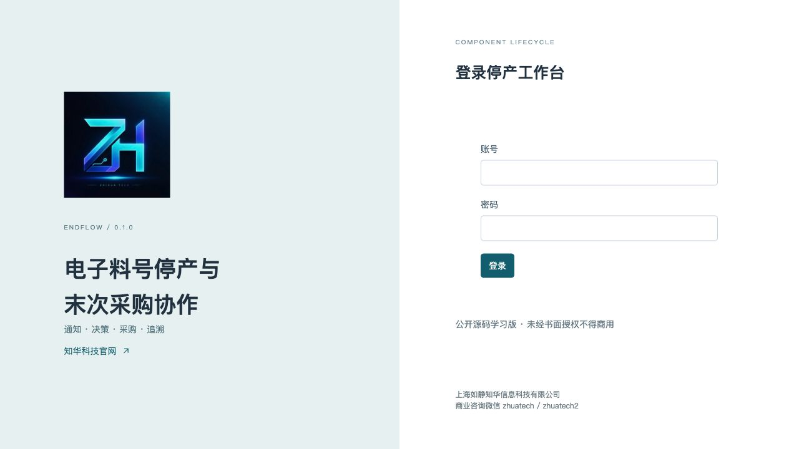
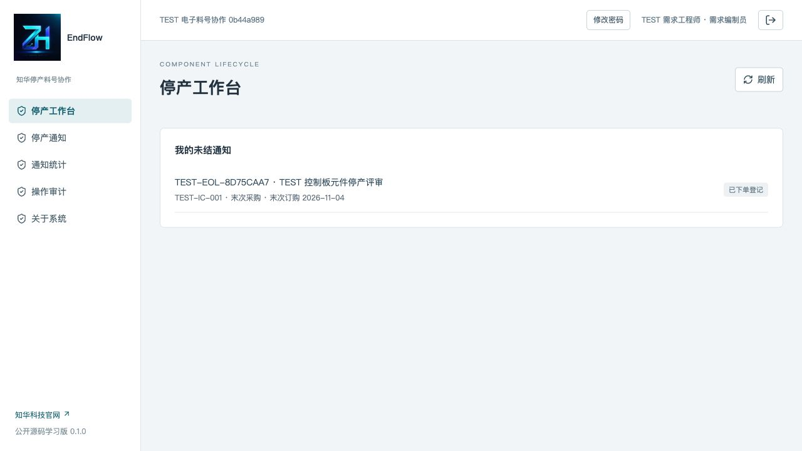
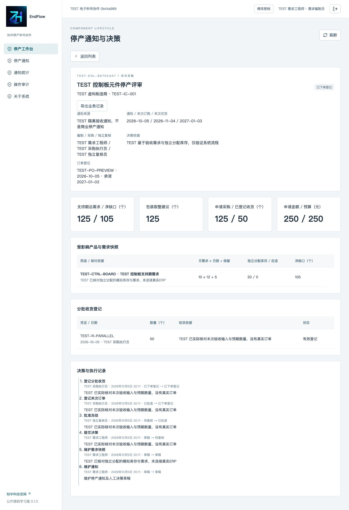
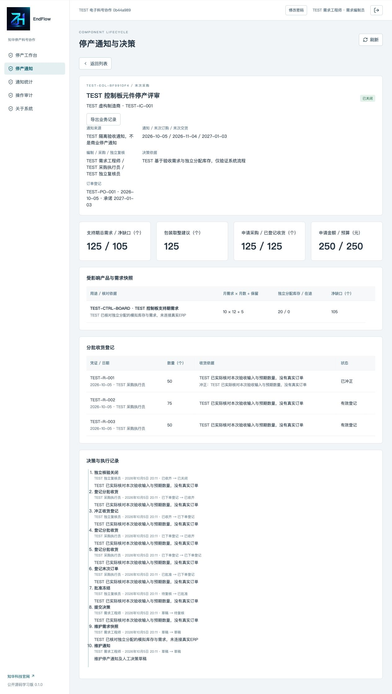
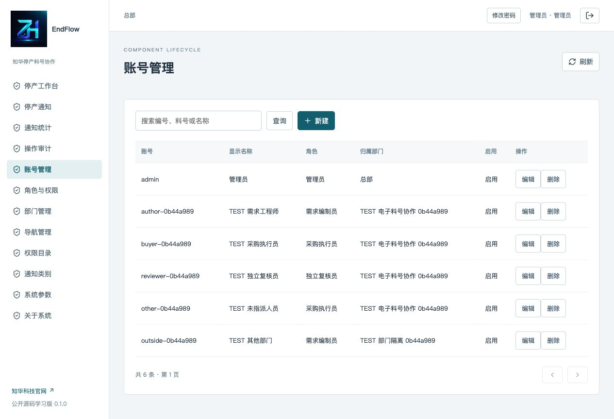
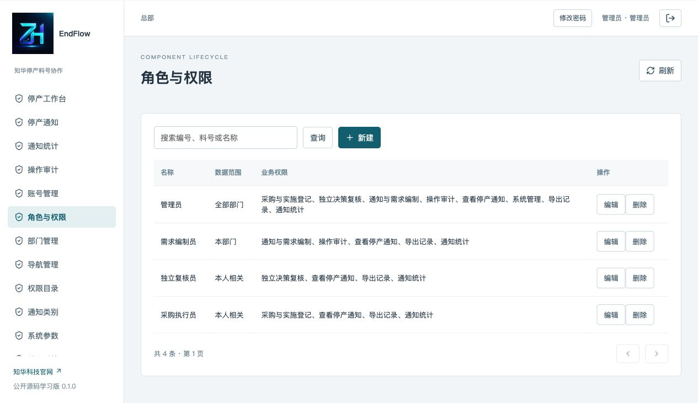
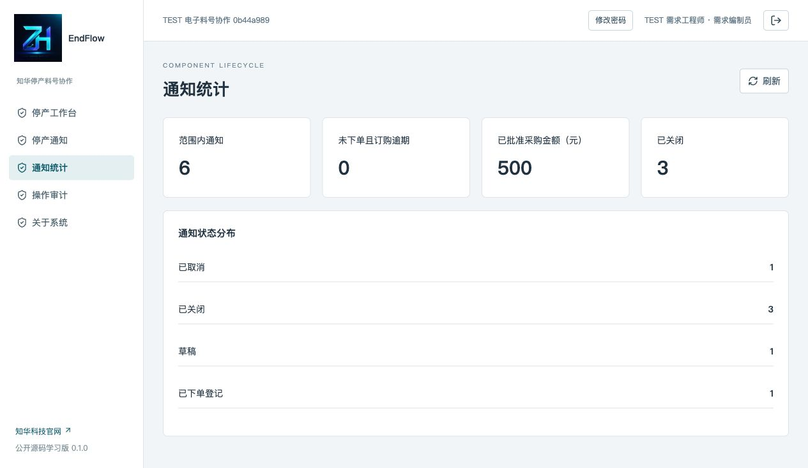

[中文](README.md) | [English](README.en.md)

# EndFlow · Electronic Component End-of-Life and Last-Time Buy Coordination


**Public source for learning 0.1.0 / non-commercial use** · Java 21 / Spring Boot / Vue 3 / MySQL 8.

**ZhiHua Technology (Shanghai Rujing Zhihua Information Technology Co., Ltd.)** · [Official website](https://www.zhuatech.cn/)

Personal learning, technical research and non-commercial exchange only. Commercial use requires prior written authorization; see [LICENSE](LICENSE).

## From an end-of-life notice to closure

Electronics, industrial control and maintenance teams need to decide before a manufacturer's last-order deadline whether to buy, switch to a verified alternative or retire the associated product. EndFlow links the original notice, affected product demand, independently allocated stock/inbound supply, approved quantities and actual receipt evidence.

For one organization's engineering, supply-chain, purchasing and independent review roles. It preserves a checkable decision baseline, exposes overdue unplaced orders and prevents receipt registration beyond approved quantities, supporting later review and handover.

**This is a manual coordination record.** It does not read email/supplier websites, expand BOMs, connect to ERP/WMS, place supplier orders, make bank payments or verify electrical compatibility. Original manufacturer documents govern dates/rules. People first verify supply allocation in actual inventory systems; this record system does not reserve physical stock.

### Three implemented routes

| Route | States and actors |
|---|---|
| Last-time buy | Draft → submit → independent approval/freeze → assigned buyer records today's actual order → partial receipts → independent closure |
| Alternative component | Distinct candidate part and verification reference → independent approval/freeze → assigned buyer records actual engineering-change implementation → independent closure |
| Product retirement | Demand/retirement basis → independent approval/freeze → actual retirement evidence → independent closure |

Review can return a draft. Submitted or approved-but-unexecuted decisions may be independently canceled. Ordered records cannot be canceled to erase fulfillment. Closed notices cannot be modified or reversed.

### Quantities and financial basis

Each product use is calculated in integer pieces:

```text
Support demand = monthly demand × support months + service reserve
Use shortage = max(0, support demand - independently allocated stock - allocated inbound)
Total shortage = sum of separate use shortages
Suggested buy = zero if shortage is zero;
                otherwise round max(shortage, minimum order) up to a pack multiple
Requested amount = requested quantity × unit price, expressed in RMB with two decimals
```

One use's excess supply does not reduce another use's shortage without reallocation. Requested quantities must cover the suggestion/minimum/pack rule and stay within the notice budget. Reasons for excess quantities are retained for independent review. No demand prediction, truth guarantee, mixed units, foreign currency or tax calculation is provided.

## Business and administrative interfaces

| Module | Implemented features |
|---|---|
| My workspace | Personally assigned open notices, routes, states and deadlines |
| End-of-life notices | One manufacturer part per notice; source, dates, roles, budget and route; search, state filter, three sort modes and pagination |
| Demand snapshots | Uses, support periods, reserves, allocated stock/inbound and evidence; draft CRUD and freeze on submission |
| Review | Author/reviewer and buyer/reviewer independence; submit, approve, return and cancel |
| Actual fulfillment | Today's actual order, promised delivery, partial receipts, overquantity checks, independent retained reversals, implementation evidence and closure |
| Statistics/exports | Authorized states, overdue unplaced orders, approved buy amounts and original JSON evidence |
| Administration | Accounts, departments, roles, permission descriptions, registered menu labels/permissions/order, dictionaries/settings; protected built-ins and last ALL administrator |
| Security/history | BCrypt cost 12, same-origin sessions, CSRF, live checks, ALL/DEPARTMENT/SELF, versions, exact UUID retries, business events and audit |
| About | Version, company, website, license and front-end dependency notices |

Administrators prepare roles/departments. Business roles use the same responsive pages; current roles determine menus. SELF grants only personally authored, purchased or reviewed notices in the same department. Knowing an ID cannot bypass detail/export checks. Functional permission does not replace explicit assignment; administrators have no assignment bypass.

Limits: 100 demand lines and 200 original receipt entries per notice, including reversed receipts. Notice capacity defaults to 1,000, adjustable from 100 to 1,000. Administration directories are bounded at 10,000; audit shows the latest 500 authorized rows. Notice details retain their events. Quantities are integers; suggested/requested quantities are at most one billion pieces and support periods at most 120 months.

## Actual running pages

Screenshots are real isolated-environment operations. TEST records are acceptance inputs, not actual customer/supplier business.

### Login and authorization



Login: actual account authentication into the authorized workspace.

### Open-work workspace



Workspace: assigned open notices and last-order deadlines.

### Notice, shortages and frozen decision



Notice details: product-use snapshots, independently allocated supplies and frozen decisions.

### Partial receipts and independent reversals



Receipts: actual quantities/evidence with retained original rows on independent reversal.

### Administrator accounts



Accounts: departments, roles, assignments and enabled state.

### Roles and data scopes



Roles: functional permissions and ALL/department/SELF scopes.

### States and approved buy amounts



Statistics: authorized states, overdue unplaced orders and approved requested amounts.

## Architecture, runtime and directory structure

Vue browser → same-origin Nginx `/api` → Spring Boot REST/transactions → MySQL 8.4. Flyway V1 handles identity and V2 handles end-of-life business.

| Layer | Versions/purpose |
|---|---|
| Backend | Java 21, Maven 3.9, Spring Boot 4.0.7, Security, JPA and Flyway |
| Database | MySQL 8.4, MariaDB JDBC 3.5.10; H2 for automated integration tests only |
| Frontend | Node.js 24.19.0+, npm 11, Vue 3.5.40, Vite 8.1.5 and Lucide 1.48.0 |
| Deployment | Docker Engine, Compose v2, BuildKit and Nginx 1.29 |
| Checks | Spotless 2.43, JUnit, ESLint 10.11, Prettier 3.9 and Node tests |

```text
backend/           Identity, administration, domain transactions, authorization and HTTP
  src/main/resources/db/migration/  Complete versioned SQL
  src/test/        Arithmetic and HTTP integration tests
frontend/          Responsive Vue business/admin pages and original brand assets
scripts/           Private configuration, actual MySQL acceptance and release checks
compose.yaml       MySQL, backend, frontend and health dependencies
.env.example       Required configuration names without credentials
LICENSE            Non-commercial source license
THIRD_PARTY_NOTICES.md / docs/licenses/  Third-party copyright
```

## Empty-database installation

Python 3, Docker Engine/Desktop and Compose v2 are required. First builds need official image/public dependency access. Source development additionally needs the Java/Maven/Node/MySQL versions above.

```sh
python3 scripts/init-env.py
docker compose config --quiet
docker compose up -d --build --wait
```

Open **[http://127.0.0.1:8120/](http://127.0.0.1:8120/)**. Username: `admin`; read `ADMIN_PASSWORD` in your own local ignored `.env`. The script creates independent strong random passwords with mode 0600 and refuses to overwrite configuration. If configuration exists, start directly. There is no hardcoded shared demo password. Initial setup creates headquarters, four roles, permissions/menus, categories/settings; it creates no notices/purchase records. Restarts retain existing passwords/data.

Create departments and author, buyer and independent reviewer accounts. Reviewer must differ from both author and buyer; author/buyer may be the same authorized person. All assigned people belong to the notice department and hold required permissions. See [User manual](docs/操作手册.md); detailed linked manuals are currently in Chinese.

### Configuration

| Name | Meaning |
|---|---|
| `DATABASE_PASSWORD` | Required application database password |
| `MYSQL_ROOT_PASSWORD` | Required MySQL initialization password |
| `ADMIN_PASSWORD` | Empty-database administrator only; at least 12 characters including upper/lowercase and digits, at most 72 bytes |
| `WEB_PORT` | Default 8120; use an available port if occupied |
| `BIND_ADDRESS` | Default 127.0.0.1; external entry needs HTTPS proxy/access controls |
| `COOKIE_SECURE` | false for local HTTP; true for HTTPS |
| `DATABASE_URL` / `DATABASE_USER` / `DATABASE_CATALOG` | Direct backend overrides for a separate MySQL; catalog must match the database |

See [.env.example](.env.example). MySQL has no host port. [Health](http://127.0.0.1:8120/actuator/health) exposes health only. All three services have ordered health checks.

### Source development

Prepare independent MySQL 8.4 and an application account; inject connection/catalog/password/admin environment values through controlled configuration:

```sh
cd backend
mvn spring-boot:run
```

In another terminal at the repository root:

```sh
cd frontend
npm ci
npm run dev
```

Frontend development: `http://127.0.0.1:5173`, proxying backend port 8080. Flyway runs at backend startup; JPA validates without modifying tables. Do not put actual credentials in source/history. Host backend execution does not automatically read `.env`.

## Data initialization, deployment and upgrades

[V1 identity](backend/src/main/resources/db/migration/V1__identity.sql) and [V2 business](backend/src/main/resources/db/migration/V2__eol.sql) contain complete schemas. Business tables include `eol_case`, `demand_line`, `receipt`, `case_event` and `command_record`. Foreign keys protect accounts/departments/history; notice codes, product-use codes and receipt references are unique. Business/admin writes share the headquarters lock, refresh identity and check versions/UUIDs at READ COMMITTED. This is a small-team serial-write design, not a throughput guarantee.

Before upgrading, securely retain the database, private configuration and image versions. Verify the new version on a restored copy. Append higher-version migrations; never edit executed files, delete Flyway history or delete actual volumes to fix failure. Switch only after recovery, migrations and health succeed. Reverting an upgraded database requires a matching version and verified preupgrade backup, not blindly running old code.

Use a complete consistent logical backup in a restricted private location outside source. It contains password hashes and business evidence. Restore to a new project, database volume and web port; start MySQL, import the complete backup, then start matching applications. Check Flyway, account logins, original notices, demands, receipt/reversal history and events; use private isolated acceptance state with `--verify` as appropriate. Do not overwrite a live database.

`docker compose down` retains the database; **`down -v` deletes data and is only for explicitly disposable tests**. External hosting requires prior commercial authorization, trusted HTTPS/proxy configuration, `COOKIE_SECURE=true`, controlled secrets, access isolation, backups and monitoring. See [Deployment and recovery](docs/部署手册.md). There is no automatic backup, clustering, cross-region recovery or cloud setup.

## Validation

```sh
cd backend
TEST_ADMIN_PASSWORD="Aa9$(python3 -c 'import secrets;print(secrets.token_hex(20))')" mvn spotless:check clean test package
cd ../frontend
npm ci
npm run format:check
npm run lint
npm test
npm run build
cd ..
python3 -m py_compile scripts/*.py
docker compose config --quiet
docker compose build
python3 scripts/smoke.py --allow-test-writes
python3 scripts/smoke.py --verify
python3 scripts/release-check.py
```

Execute write-mode acceptance only on a fresh local isolated disposable database. Tests cover separate shortages, pack/minimum rounding, zero/total bounds, all three routes, independent receipt reversals, department/SELF scopes, invalid states, dates, retries, concurrency, versions, budgets/quantities, CSRF and password sessions. Backend integration tests use isolated H2; actual MySQL acceptance remains separate. Image builds execute backend tests without skipping. Private temporary credentials in ignored `.smoke-state.json` support reauthentication and persistence verification; never publish them. `--base` selects an isolated test target, including an independently restored environment.

See [Architecture](docs/架构说明.md), [API](docs/接口说明.md) and [Security](docs/安全说明.md). Included CI configuration is not evidence of a remote CI run until actually triggered and observed.

## Troubleshooting and limits

- **Startup fails:** this project's backend/MySQL logs, versions, configuration and health; preserve actual volumes and execute tests.
- **Login fails:** initialized local password or the latest changed value; eight failures cause a five-minute account limit.
- **Missing record:** enabled status, department, scope and assignment; visible menus do not grant all actions.
- **Submission fails:** demand evidence, pack multiples, budget/deadline; alternative routes need separately verified reports and zero buy quantity.
- **Version conflict:** refresh/review before retry; UUIDs cannot be reused with different payloads.
- **Incorrect receipt:** assigned independent reviewer reverses before closure, then record a new unique reference; reversal is a ledger correction, not physical return/refund.
- **Expired order deadline:** retain original facts, reconsider/return or cancel an unexecuted decision; never change dates to conceal execution.
- **Late actual delivery:** truthfully record dates from order day through today; promised dates are not actual dates and lateness is not automatically excused.

HttpOnly/SameSite Strict sessions and CSRF protect writes; account disablement, permission withdrawal and password changes are rechecked. Single-origin/single-organization only: no multi-tenancy, SSO, email, file attachments, automatic purchasing, prediction or automatic backup. The operator verifies actual facts, HTTPS, isolation and recovery.

Records do not replace engineering validation, contracts or physical inventory control, guarantee supplier fulfillment/correct purchasing decisions or establish component compatibility.

## Contributions, license and contact

Run formatting/tests/build before contributing; business changes need state, scope and database validation. Preserve copyrights and redact feedback. Do not commit customer records, credentials, tokens, production logs or personal data. Report security concerns privately without public exploit payloads.

Own code uses [ZhuaTech Non-Commercial Source License 1.0](LICENSE), permitting personal learning, technical research and non-commercial exchange only. **Commercial use requires prior written authorization from Shanghai Rujing Zhihua Information Technology Co., Ltd.** Enterprise private hosting, paid delivery/services, SaaS, resale and in-depth customization require separate authorization. Preserve attribution, website, copyright, license and licensing contacts. Third-party licenses remain separate. This is publicly readable non-commercial source, not an OSI-approved license; software is provided as is, with no unverified production-readiness claim.

For commercial licensing, in-depth custom development, deployment or system integration, contact **ZhiHua Technology (Shanghai Rujing Zhihua Information Technology Co., Ltd.)**:

- Website: [https://www.zhuatech.cn/](https://www.zhuatech.cn/)
- Email: [han@zhuatech.cn](mailto:han@zhuatech.cn)
- Email: [jack@zhuatech.cn](mailto:jack@zhuatech.cn)
- WhatsApp: [+86 17521234993](https://wa.me/8617521234993)
